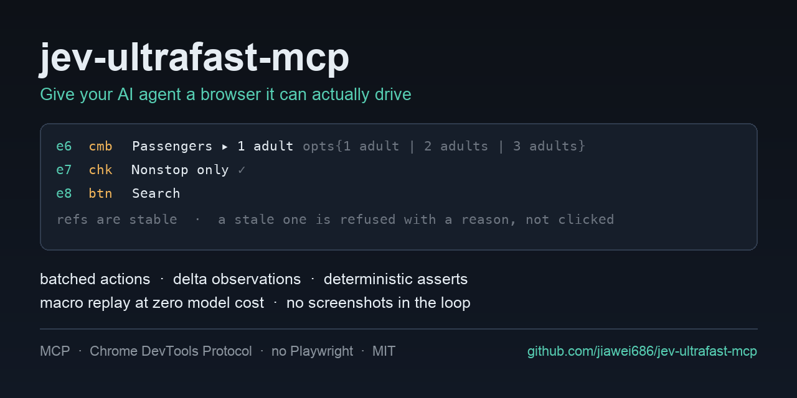

# jev-ultrafast-mcp

[](https://github.com/jiawei686/jev-ultrafast-mcp/actions/workflows/ci.yml)
[](LICENSE)
[](pyproject.toml)

[English](README.md) · **简体中文**



**把浏览器里的活交出去 —— 一个能替你的 agent 开页面、点按钮的 MCP server。**

## 快速开始

克隆一次、给客户端写一行配置、重启一次。

```bash
git clone https://github.com/jiawei686/jev-ultrafast-mcp.git
cd jev-ultrafast-mcp
python3 -m venv .venv
.venv/bin/pip install -e .          # Windows: .venv\Scripts\pip install -e .

python scripts/install.py           # 自动识别你装了的 MCP 客户端并写入配置
```

`install.py` 会去找 WorkBuddy、Claude Code、Claude Desktop、Codex CLI、Cursor、VS Code、Cline、
Windsurf、Gemini CLI，并按各自要求的格式写配置 —— 它是**合并**而不是覆盖，动手前先存一份 `.bak`。
重启客户端，十个工具就在它的工具列表里了。依赖：Python ≥ 3.10，以及一个 Chromium 系浏览器
（Chrome / Chromium / Edge / Brave）。

然后对它说句话试试 —— 自己握着方向盘，或者把整个目标交给 `browser_goal`：

> **你**：打开 example.com，告诉我页面上写了什么。
> **它**：`browser_open` 读出元素表然后回答 —— [逐字实录](#一次会话实际长什么样)。

> **你**：把这个表单设成 3 个成人、勾上 *Nonstop only*、然后提交。
> **它**：`browser_goal(goal=…, verify=[…])` —— **只调一次**；循环在服务端跑完，跑完由代码核对
> 页面 —— [交出去要花多少](#或者把整件事交出去)。

<details>
<summary><b>当包装装、以及安装脚本的各个开关</b></summary>

不想克隆也可以，直接当包装。它还没上 PyPI，所以就从仓库装：

```bash
python3 -m venv ~/.jev-ultrafast-mcp/venv
~/.jev-ultrafast-mcp/venv/bin/pip install "git+https://github.com/jiawei686/jev-ultrafast-mcp"
```

这会给你一个 `jev-ultrafast-mcp` 命令，以及一个可以填进客户端配置的稳定解释器路径 —— 已在
Python 3.13 + 最新 `mcp` SDK 上实测：十个工具全部正常列出。

```bash
python scripts/install.py --list              # 看装了哪些、各自读哪个文件
python scripts/install.py --print             # 只打印将要写入的配置，不动任何文件
python scripts/install.py -c cursor,codex     # 只装这两个
python scripts/install.py --headed            # 保留可见的浏览器窗口
python scripts/install.py --allow-domains example.com,*.example.org
python scripts/install.py --uninstall         # 把条目删回去
```

运行时只依赖 `mcp`、`websockets`、`httpx` —— 不用 Playwright、不用 Selenium、不用
browser-harness。

</details>

---

## 这是什么

大多数浏览器自动化是让 **agent 自己开**：读页面、挑一个元素、动手、再读一遍确认成不成功。点十次就是十个回合，页面每次都要过一遍 agent 的上下文，而点错元素通常不会有任何提示。

这个服务可以把这活接过来。`browser_goal` 对你的 agent 来说只是**一次**工具调用；循环在这里、在服务端跑，由 Jev（TypeSafe 的决策模型）决定每一步。它**从不写选择器**：它只在页面真实存在的元素里挑，挑不中服务端就拒绝执行而不是猜。结束时 `browser_assert` 用代码核对它留下的页面，而**断言通过就压过模型自己的说辞**。

- **一次调用顶一长串点击**。仓库里那个端到端实例：3 步的目标，真实页面上跑了 **4 次决策、14,626 tokens、
  模型 1.8 s + 页面 1.1 s、总计 3.3 s** —— 而你的 agent 只花了一个回合。每次运行都会打印这些数字，
  所以这是**能自己复核的**，不用听我讲。
- **准确率来自结构，不来自叮嘱**。目标是元素表里的 `ref`，不是模型自己编出来的选择器或坐标；动作执行前
  还会拿页面再核对一次。
- **第一次之后免费**。把路径录下来，之后回放**零模型调用**、连 key 都不需要，页面变了它会拒绝乱点。
- **只有文字，没有像素**。不截图、不 dump HTML，直接和本机已有的 Chrome 讲 CDP ——
  不用 Playwright、不用 Selenium、没有截图管线。

除了 `browser_goal` 之外的**所有**工具 —— `browser_open`、`browser_observe`、`browser_act`、
`browser_assert`、`browser_macro` —— 都不需要 key、不需要账号、除了目标页面本身也不联任何网，
WorkBuddy、Claude Code、Codex、Cursor、VS Code 都能接。你想自己握着方向盘，这套工具面照样在。

```
browser_open  →  元素表  →  browser_act [refs]  →  browser_assert
```

思路受 [`browser-use/jev-ultrafast`](https://github.com/browser-use/jev-ultrafast) 和 TypeSafe 的
typed-question API 启发。本项目是独立实现，与两者均无隶属关系；差异化的取舍见
[`docs/DESIGN.md`](docs/DESIGN.md)。

**目录** ·
[快速开始](#快速开始) ·
[一次会话长什么样](#一次会话实际长什么样) ·
[接入各类 agent](#接入各类-agent) ·
[可以拿它做什么](#可以拿它做什么) ·
[agent 实际读到的东西](#agent-实际读到的东西) ·
[为什么再造一个浏览器 MCP](#为什么还要再造一个浏览器-mcp) ·
[工具](#工具) ·
[配置](#配置) ·
[常见问题](#常见问题) ·
[不接 agent 也能试](#不接-agent-也能试) ·
[相关项目](#相关项目)

---

## 一次会话实际长什么样

你对 agent 说：

> 打开 example.com，告诉我页面上写了什么。

agent 做了这些，而它看到的全部内容就是下面这些：

```
browser_open("https://example.com")
  [obs#1] https://example.com/  "Example Domain"  scroll=0/216  reachable=1/1
  e1   lnk    More information...

browser_observe()
  [delta#2] … 1 element
    = no change (1 element)
```

然后它回答你。全程没有截图、没有 dump HTML，页面也从未进过任何模型的上下文 —— 是你的 agent 自己读的表、自己答的。

### 或者，把整件事交出去

同一个服务，换一种分工。你的 agent 只发目标（不发页面），拿回来六行：

```
browser_goal(
  goal="On this flight search form: set Passengers to 3 adults, tick the 'Nonstop only' "
       "checkbox, then submit the search. Do not type into any city field.",
  verify=[{"type": "text_contains", "text": "3 adults · nonstop"}],
)

goal: On this flight search form: set Passengers to 3 adults, …
status: done
steps: 3
turbo: 4 decisions · 14,626 tokens · 1.8s model + 1.1s page · 3.3s wall
trace:
  1. SELECT e6 Passengers → ok (759ms model / 30ms browser)
  2. TOGGLE e7 Nonstop only → ok (336ms model / 692ms browser)
  3. CLICK e8 Search → ok (370ms model / 410ms browser)
  4. DONE (conf 0.93)
verified: PASS
  ok text_contains: '3 adults · nonstop' found in page text
```

那三次动作、以及动作之间一次次的「再读一遍页面」，都发生在这里，**不在你 agent 的上下文里**。
它花了一个回合，而且自始至终没见过元素表。这是**逐字实录**：`scripts/turbo_check.py` 用真实 Chrome
和真实模型复现这段，跑完再**用代码核对页面**，而不是听模型自称成功。

「谁来干活」是这个项目唯一重要的设计取舍，所以它由你按任务决定：

| | agent 自己开 | **`browser_goal` 开** |
|---|---|---|
| 3 步流程的工具调用次数 | 6 次以上（observe、act、observe、act…） | **1 次** |
| 页面在谁的上下文里 | 你的 agent | **决策模型，在服务端** |
| 每一步的成本 | 一个 agent 回合 | 一次类型化请求，无截图 |
| 谁指定目标元素 | 模型写选择器 | **模型从页面自己的元素表里挑 `ref`** |
| 出错时 | 点错元素，通常无声无息 | **服务端拒绝执行，并给出原因** |
| 怎么知道做成了 | 模型自己说 | **代码核对的断言，且冲突时断言说了算** |
| 第二次做同一件事 | 再跑一遍模型 | **回放宏，零模型调用** |

再看一个更真实的 —— 在真实站点上搜索，这次由你的 agent 自己开：

```
browser_open("https://duckduckgo.com")
  e4   cmb*   Search with DuckDuckGo ▸ ""

browser_act([{type, ref: "e4", text: "python asyncio tutorial"}, {keys, key: "Enter"}])
      → 2/2 ops ok，一次往返，页面已跳转

browser_observe()
  [delta#3] https://duckduckgo.com/?…&q=python+asyncio+tutorial  reachable=9/59
  + e5   lnk    Python Asyncio Tutorial
  + e6   lnk    Async IO in Python: A Complete Walkthrough
  …
    43 new, 0 changed, 0 gone

browser_assert([{url_contains, text: "q="}, {count_at_least, role: "link", min: 5}])
  PASS
```

这段是**真实联网跑出来的原样输出**，`scripts/live_check.py` 可以完整复现。

---

## 接入各类 agent

| 客户端 | `install.py` 写入的配置文件 | 装完还要做什么 |
|---|---|---|
| **WorkBuddy** | `~/.workbuddy/mcp.json` | 连接器 → 自定义连接器 → 点**信任** |
| **Claude Code** | `~/.claude.json`（user 作用域） | 或直接 `claude mcp add --scope user …` |
| **Claude Desktop** | `~/Library/Application Support/Claude/claude_desktop_config.json` | 从托盘完全退出再打开 |
| **Codex CLI** | `~/.codex/config.toml` | `codex mcp list` 确认 |
| **Cursor** | `~/.cursor/mcp.json` | 重载窗口 |
| **VS Code (Copilot)** | `…/Code/User/mcp.json` | 只在 Agent 模式可用，Ask/Edit 不行 |
| **Cline** | `…/Code/User/globalStorage/saoudrizwan.claude-dev/settings/cline_mcp_settings.json` | 重载窗口 |
| **Windsurf** | `~/.codeium/windsurf/mcp_config.json` | 重载窗口 |
| **Gemini CLI** | `~/.gemini/settings.json` | `gemini mcp list` 确认 |

<details>
<summary><b>手动配置</b> —— 不想跑安装脚本的话</summary>

下面每个客户端要的都是同一件事：解释器的绝对路径、模块名、一个环境变量。把 `/ABS/PATH`
换成你自己的路径。

**WorkBuddy** —— `~/.workbuddy/mcp.json`

```json
{
  "mcpServers": {
    "jev-ultrafast-mcp": {
      "command": "/ABS/PATH/jev-ultrafast-mcp/.venv/bin/python",
      "args": ["-m", "jev_ultrafast_mcp"],
      "env": { "JEVMCP_HEADLESS": "1" }
    }
  }
}
```

**Claude Code**

```bash
claude mcp add --scope user jev-ultrafast-mcp \
  --env JEVMCP_HEADLESS=1 \
  -- /ABS/PATH/jev-ultrafast-mcp/.venv/bin/python -m jev_ultrafast_mcp
```

也可以手写同样的 `mcpServers` 对象：`~/.claude.json` 是 user 作用域，项目根目录的 `.mcp.json`
是团队作用域（会提交进 git）。

**Codex CLI** —— `~/.codex/config.toml`。Codex 用 TOML，而且表名是 `mcp_servers`，不是
`mcpServers`：

```toml
[mcp_servers.jev-ultrafast-mcp]
command = "/ABS/PATH/jev-ultrafast-mcp/.venv/bin/python"
args = ["-m", "jev_ultrafast_mcp"]
startup_timeout_sec = 20

[mcp_servers.jev-ultrafast-mcp.env]
JEVMCP_HEADLESS = "1"
```

同一条也可以用命令加：`codex mcp add jev-ultrafast-mcp --env JEVMCP_HEADLESS=1 -- /ABS/PATH/…/python -m jev_ultrafast_mcp`。

**Cursor** —— 全局 `~/.cursor/mcp.json`，或单个项目的 `.cursor/mcp.json`。内容和 WorkBuddy 一样。

**VS Code (Copilot)** —— `.vscode/mcp.json`，或者命令面板 → *MCP: Open User Configuration*
（对所有工作区生效）。VS Code 有两处和别家不同：根键是 `servers`，而且每条必须显式写
`"type": "stdio"`，否则会被静默忽略。

```json
{
  "servers": {
    "jev-ultrafast-mcp": {
      "type": "stdio",
      "command": "/ABS/PATH/jev-ultrafast-mcp/.venv/bin/python",
      "args": ["-m", "jev_ultrafast_mcp"],
      "env": { "JEVMCP_HEADLESS": "1" }
    }
  }
}
```

**Claude Desktop** —— `claude_desktop_config.json`（Windows 在 `%APPDATA%\Claude\`），同样是
`mcpServers` 对象。要从托盘完全退出再启动，光关窗口不够。

</details>

浏览器在第一次 `browser_open` 之前不会启动；它驱动的标签页是**自己拥有的后台标签页** ——
焦点模拟让动画和菜单照常运行，但不会抢你的窗口。

---

## 可以拿它做什么

| 你可以这样说 | 实际发生的事 |
|---|---|
| "打开这个页面，告诉我上面写了什么" | 读可见文本 + 可操作控件 |
| "把这个表单填了并提交" | 一次 `browser_act` 批量填多个字段，只花一次往返 |
| "登录进去，把上个月的发票下下来" | 你手动登录一次，profile 会一直留着 |
| "把这个列表里每个商品页都检查一遍" | 在你的 agent 里循环，ref 在步骤之间保持有效 |
| "这件事明天再做一遍" | 录成**宏**，回放**零模型调用** |
| "这次部署到底上了没有？" | `browser_assert` 给 PASS/FAIL，不是「感觉」 |
| "在测试环境把下单流程点一遍" | 类似支付的按钮会返回 `needs_confirmation`，不直接执行 |

## 它**做不到**什么

把边界说清楚，对谁都省时间：

- **它不看像素。** 验证码、图表、纯 canvas 应用 —— 任何需要真正视觉判断的东西都不在范围内。
  这类场景请换"截图 + 视觉"的 agent，或者在这里用 `screenshot` 操作留下证据给**人**看。
- **它不是爬虫框架。** 一个浏览器、一次一个会话。没有代理轮换、没有并发、不面向大规模抓取。
- **它不是给人用的录制器。** 没有"点一下录一步"的界面；宏是 agent 正常干活时录下来的。

---

## agent 实际读到的东西

不是 DOM dump，也不是截图 —— 是一张它能操作的控件表。每行是 `ref`（元素编号）+ 角色简码 +
标记 + 可访问名称；可编辑的带上当前值，可选择的带上选项：

```
[obs#1] http://127.0.0.1:54409/fixture.html  "Ultrafast Fixture"  scroll=0/860  reachable=16/16
e1   lnk    Home
e2   lnk    About
e3   lnk    Open popup
e4   inp*   Where from? ▸ ""
e5   cmb*   Where to? ▸ ""
e6   cmb    Passengers ▸ 1 adult opts{1 adult=1 | 2 adults=2 | 3 adults=3 | 4 adults=4}
e7   chk·   Nonstop only
e8   btn    Search
e10  inp*   Password ▸ ""
e11  file    CV accept=.pdf,.txt
e12  btn    Delete account
```

标记含义：`*` 可编辑 · `»` 在视口外（服务端会先滚到它） · `⊘` 被别的东西盖住 · `▾` 已展开 ·
`✓`/`·` 勾选状态。`reachable=16/19` 表示页面上有 3 个控件此刻被遮挡或不在视口内。

操作之后只回报**变化的部分** —— 这是长流程里最大的一笔开销节省：

```
[delta#2] http://127.0.0.1:54409/fixture.html  "Ultrafast Fixture"  reachable=16/16
~ e4   inp*   Where from? ▸ "Zurich"   (was "")
~ e7   chk✓   Nonstop only
  2 changed, 0 new, 0 gone
```

**「操作了什么都没发生」是 agent 循环里最贵的一种情况**，因为模型会重试。所以这件事被压缩成一行：

```
[delta#3] … 16 elements
  = no change (16 elements)
```

新增的行以 `+` 开头，消失的以 `-` 开头。两个控件重名时，行里会带上能区分它们的那点上下文：

```
+ e17  btn    Select  @Zurich → Anywhere Option 1 · 1 adult · nonstop Select
+ e18  btn    Select  @Zurich → Anywhere Option 2 · 1 adult · nonstop Select
```

已经失效的 ref 会被**拒绝并给出原因**，而不是点到错误的元素上：

```json
[{"op": "click", "ok": false, "ref": "e999", "error": "detached"}]
```

---

## 为什么还要再造一个浏览器 MCP？

两个不同点，第一个是它存在的理由。

**允许 agent 不自己开。** 浏览器流程本质是个循环，而在多数服务里这个循环住在**调用方 agent** 身上：
读页面 → 点一个元素 → 等 → 再读。两步还凑合，二十步就荒谬了 —— 为了做一件小模型一次调用就能干完的
事，烧掉二十个昂贵上下文的回合。这里你可以把整个目标交出去（`browser_goal`），只付一个回合，让 Jev
在服务端把循环跑完；也可以自己握着方向盘。两条路径用的是同一套工具、同一套护栏。

**模型永远不会自己编一个目标。** 多数浏览器 MCP 暴露的是 CDP 原语 —— `click_at_xy`、CSS 选择器、
`evaluate`。灵活性拉满，安全性见底：选择器写错要么静默失败，要么更糟 —— 点在了错的元素上，而它
看起来成功了。这里目标是页面元素表里的 `ref`，把 ref 变成真实点击是服务端的事，服务端**宁可拒绝，
也不猜**。这也正是「交出去」安全的由来：无论谁来开，它都是在页面**真实存在的选项**里挑，
所以准确率不依赖它「足够小心」。

| | 原语型浏览器 MCP | **jev-ultrafast-mcp** |
|---|---|---|
| 谁跑这个循环 | 调用方 agent，每一步 | **都可以 —— `browser_goal` 让服务端来跑** |
| 怎么指定目标 | 模型自己写选择器 / 坐标 / JS | **元素表里的一个 `ref`** |
| 额外模型调用 | 无 | **自己开不需要；`browser_goal` 是可选的** |
| 需要的 API key | 无 | **浏览器工具都不需要**；只有 `browser_goal` 需要一把决策模型的 key |
| ref 生命周期 | 不适用（每步重造） | **跨观测稳定** |
| 重读页面 | 每次全量 dump | **增量**：`+` 新增 / `~` 变更 / `-` 移除 / `= no change` |
| 往返次数 | 每个动作一次 | **批量**：多个 op 一次往返 |
| 目标有歧义 | 模型猜 | **服务端拒绝并说明原因** |
| Shadow DOM / iframe | 通常不支持 | **可穿透，滚动会带上 frame 偏移** |
| 渲染慢的页面 | 靠 agent 自己 sleep | **等到控件出现为止，且有上限** |
| 重复流程 | 重跑模型 | **宏回放，零模型成本** |
| 怎么知道做成了 | 模型自己看页面 | **确定性 `browser_assert`，且与模型冲突时断言说了算** |
| 危险点击 | 模型自己判断 | **`needs_confirmation`、域名白名单、敏感字段脱敏** |

批量和增量不是锦上添花。在仓库自带的端到端测试里，27 个操作及其后续观察一共交给模型
**15.4 KB**，其中 **13.6 KB 是增量、1.8 KB 是全量表** —— 模型只重读页面上动过的那部分。

---

## 工具

一共十个，多数会话只会用到其中四个。

### `browser_open(url, session="default", hint="")`
在自有标签页里打开 URL，返回完整元素表。`hint` 用一句话重述目标，会被原样回显。

### `browser_observe(session="default", mode="auto", include_text=True, include_json=False)`
重读页面。`auto` 出增量，`full` 强制全量，`delta` 强制差分。出现 `= no change` 意味着上一个动作
什么都没做 —— **该换策略，不要重试**。

### `browser_act(ops, session="default", dry_run=False, stop_on_error=True, observe_after=True)`
按顺序在**一次往返**里执行 ops，然后返回增量。

| op | 字段 |
|---|---|
| `click` | `ref` |
| `type` | `ref`、`text`、`clear`=true、`submit`=false、`slow` |
| `select` | `ref`、`value`（选项 value 或 label） |
| `toggle` | `ref`、`state`（不填则翻转） |
| `hover` / `upload` | `ref` / `ref`、`path` |
| `keys` | `key`（`"Enter"`、`"Meta+A"`、`"ArrowDown"`） |
| `scroll` | `dir`、`amount`、`ref` |
| `nav` / `back` / `forward` / `reload` | `url`（`nav` 用） |
| `wait` / `wait_for_ref` / `wait_for_text` / `wait_for_load` | `ms` / `ref`,`timeout_ms` / `text` / `timeout_ms` |
| `screenshot` | `path`、`full`、`format`（`jpeg` 或 `png`） |
| `tab` | `action`=`list\|new\|switch\|close`、`target_id`、`index`、`url` |
| `eval` | `js` —— 仅在 `JEVMCP_ALLOW_JS=1` 时可用 |

```json
{"ops": [
  {"op": "type",   "ref": "e4", "text": "Zurich"},
  {"op": "select", "ref": "e6", "value": "3 adults"},
  {"op": "toggle", "ref": "e7"},
  {"op": "click",  "ref": "e8"}
]}
```

失败会说明原因：`occluded`、`detached`、`target_changed`、`page_changed`、`needs_confirmation`、
`blocked_by_policy`。这时该去 `browser_observe`，而不是重试。

操作标签页时**优先用 `target_id` 而不是 `index`**：index 是位置性的，标签列表一变就会重编号，
上一次调用读到的 index 可能已经指向另一个标签了。

### `browser_assert(checks, session="default")`
确定性断言 —— 不靠模型「感觉」判断是否完成。

```json
{"checks": [
  {"type": "url_matches",    "pattern": "*/checkout*"},
  {"type": "text_contains",  "text": "Order confirmed"},
  {"type": "element_exists", "role": "button", "name": "Continue"},
  {"type": "value_equals",   "ref": "e4", "value": "Zurich"},
  {"type": "count_at_least", "role": "link", "min": 3}
]}
```

### `browser_macro(action, session="default", name="", params={}, ...)`
`record_start` → 手动走一遍 → `record_stop` → `run`。回放**不花模型调用**：它会自己回到任务开始的
那个页面，把每一步按 role + 可访问名称重新解析，匹配偏弱或有歧义时直接报错，而不是点错东西。
`params` 会替换输入文本和 URL 里的 `{{占位符}}`。

### `browser_goal(goal, session="default", max_steps=20, verify=[...])`
在服务端跑完整个循环，用 TypeSafe 的投机扇出（每步一次请求）。需要 `TYPESAFE_API_KEY`，
或者用 `OPENROUTER_API_KEY` 并把 `TYPESAFE_BASE_URL` 指向 OpenRouter 的 decisions 路由。
给了 `verify` 检查时返回 `verified: PASS/FAIL`。

每次运行还会自报账单 —— `turbo: 4 decisions · 14,626 tokens · 1.8s model + 1.1s page · 3.3s wall`
—— 交出去到底花了多少，直接写在返回值里，还告诉你总时间里模型占了多少、页面占了多少。

决策模型所有可能的失败方式——没 key、没余额、连不上、返回的形状不对、返回的 body 不是 JSON——
统一以 `turbo_unavailable:` 返回，且**不会执行任何动作**。已经走过的步骤仍保留在 trace 里，所以
一个在第 5 步挂掉的 goal 依然会告诉你第 1–4 步做了什么。

`status` 是模型自己的总结，`verify` 由代码核对；两者冲突时**以断言为准**：只要你给的检查通过，
这次运行就报 `status: done`，不管模型说了什么，并且 trace 里会记下这次「断言推翻了模型」。
这是「最后一个动作把被操作对象本身消灭掉」这类目标的常态 —— 点完签到按钮，按钮就没了，模型
找不到还能操作的东西，于是一个其实已经成功的目标被它报成 `BLOCKED`。

### `browser_tabs` · `browser_sessions` · `browser_close` · `browser_doctor`
标签页管理（列 / 新建 / 切换 / 关闭）、会话列举、收尾，以及自检 —— 报告找到的是哪个浏览器、
能不能连上。

---

## 配置

全部可选，默认值就是设计意图。

| 环境变量 | 默认 | 含义 |
|---|---|---|
| `JEVMCP_CHROME` | 自动探测 | Chrome/Chromium/Edge/Brave 可执行文件 |
| `JEVMCP_MODE` | `launch` | `launch` 自己启动，或 `attach` 到已运行的 CDP |
| `JEVMCP_CDP_URL` | — | `mode=attach` 时填 `http://127.0.0.1:9222` |
| `JEVMCP_HEADLESS` | `1` | `0` 显示窗口 |
| `JEVMCP_FOREGROUND` | `0` | `1` 激活自有标签页 |
| `JEVMCP_SANDBOX` | `auto` | 浏览器启动即崩时，`auto` 会用 `--no-sandbox` 重试 |
| `JEVMCP_WINDOW` | `1280x860` | 浏览器窗口尺寸 |
| `JEVMCP_PROFILE_DIR` | `~/.jev-ultrafast-mcp/chrome-profile` | 持久化 profile —— 手动登录一次，之后一直保持 |
| `JEVMCP_ALLOW_DOMAINS` | *（不限）* | 逗号分隔；导航到其他域名会被拒绝 |
| `JEVMCP_DENY_DOMAINS` | *（无）* | 逗号分隔黑名单 |
| `JEVMCP_CONFIRM_PATTERNS` | pay / delete / unsubscribe … | 命中这些词的操作需要 `"confirm": true` |
| `JEVMCP_ALLOW_JS` | `0` | 打开 `eval` 与 js 断言 |
| `JEVMCP_ALLOW_UPLOADS` | `1` | 控制 `upload` op |
| `JEVMCP_MAX_ACTIONS` | `250` | 元素表条数上限，按有用程度裁剪 |
| `JEVMCP_MAX_TEXT` | `6000` | 单次观测的可见文本上限 |
| `JEVMCP_SETTLE_TIMEOUT` | `4.0` | 页面渲染慢时，最多等多久让控件出现 |
| `JEVMCP_SETTLE_POLL_MS` | `120` | 等待期间多久重读一次 |
| `JEVMCP_STATE_DIR` | `~/.jev-ultrafast-mcp` | profile、宏、截图的存放位置 |
| `TYPESAFE_API_KEY` | — | 可选；开启 `browser_goal`，直连 TypeSafe |
| `TYPESAFE_BASE_URL` | `https://api.typesafe.ai/v1/systemone` | 决策模型在哪；指到 `https://openrouter.ai/api/alpha/decisions` 即可改走 OpenRouter |
| `OPENROUTER_API_KEY` | — | 当 `TYPESAFE_BASE_URL` 是 OpenRouter 地址时，作为决策模型的 key |
| `TYPESAFE_MODEL` | `jev-latest` | 决策模型的 slug |
| `TEXT_MODEL_API_KEY` | — | 可选；只给 `browser_goal` 用的小文本助手（往输入框里写值） |
| `TEXT_MODEL_BASE_URL` | `https://api.deepseek.com/v1` | 该助手的地址 |
| `TEXT_MODEL` | `deepseek-chat` | 该助手用的模型 |

上面最后七行之前的所有变量都是本地的：它们配置的是你机器上的浏览器。只有「决策模型」这一组会联外，
而且只在 `browser_goal` 真正跑起来时才会。把 `TYPESAFE_BASE_URL` 指到 OpenRouter，那么一把
`OPENROUTER_API_KEY` 就同时覆盖决策模型和文本助手，也不需要 TypeSafe 账号。

如果你要拿它操作自己的账号，有两个值得先设上：`JEVMCP_ALLOW_DOMAINS` 把浏览器钉死在一组域名内，
之外一律拒绝；配一个持久的 `JEVMCP_PROFILE_DIR`，让你手动登录一次，而不是把密码教给模型。

---

## 常见问题

**所以这是让另一个模型来干活？那到底谁说了算？**
你说了算，而且可以按任务挑。`browser_goal` 把**一个目标**的执行权交给 Jev —— 一个小型决策模型：
该碰页面上的哪个元素，一步一步来。它不是通用 agent，目标之间没有记忆，也从不写代码或选择器，
只在服务端递给它的选项里挑。**要做什么**仍然是你的 agent 决定的，**有没有做成**由 `verify` 决定。
你如果想每一步都亲自过手，不调用那一个工具就行 —— 除此之外没有任何东西往外发。

**需要 API key 或账号吗？**
浏览器工具都不需要。`browser_open`、`browser_observe`、`browser_act`、`browser_assert`、
`browser_macro` 以及标签页 / 会话类工具**从不外联** —— 没有遥测、没有回传，没有任何东西离开
你的机器。`browser_goal` 是例外，而且它是可选的：它会把你的目标和当前元素表发给一个决策模型，
所以才需要 key。只要不用这一个工具，页面上的任何东西都不会出门。

**会不会弹出一个浏览器窗口抢我的屏幕？**
不会。默认无头运行，驱动的是**自己拥有的后台标签页** —— 动画和菜单照常工作，但不抢焦点。
想看它操作就加 `--headed`（或 `JEVMCP_HEADLESS=0`）。

**已经登录的网站怎么用？**
把 `JEVMCP_PROFILE_DIR` 指到一个持久目录，手动开一次浏览器登录，会话就记住了。这比教 agent 你的
密码好得多 —— 而且真要输入时，密码字段在观测里是脱敏的。

**什么动静都没有，页面看着是空的？**
用 JavaScript 渲染的页面会短暂「看起来是空的」。服务端会等控件出现（上限 `JEVMCP_SETTLE_TIMEOUT`），
但如果站点卡在 cookie 墙或同意弹窗后面，元素表里会体现出来 —— 注意观测头里的遮挡警告。

**有验证码，它能过吗？**
不能，而且这是刻意的 —— 它不看像素。这种场景请换"截图 + 视觉"的 agent。

**上 PyPI 了吗？进 MCP registry 了吗？**
都还没有。`pip install "git+https://github.com/jiawei686/jev-ultrafast-mcp"` 装到的和发布版完全
一样。[`server.json`](server.json) 已经在仓库里备好，给
[官方 registry](https://github.com/modelcontextprotocol/registry) 用 —— 它发布的是包，所以会和第一次
PyPI 发布同一步落地。相关进展见 [发布](CONTRIBUTING.md#publishing)。

**和 Playwright MCP 有什么区别？**
Playwright 的服务端暴露的是页面原语，选择器和坐标由 agent 自己写。这个暴露的是一张带编号的控件表，
遇到歧义会拒绝。需要像素级控制或成熟的录制测试生态 → 用 Playwright；想要一个不会悄悄点错按钮的
agent → 用这个。

**和 browser-use 是竞争关系吗？**
同一个问题，从两头解决。[`browser-use`](https://github.com/browser-use/browser-use) 是一个在进程内
自己跑 agent 循环的库；这个是一个 MCP server，把类似的一双手交给**你已有的 agent**。这里可选的
turbo 路径移植自 [`browser-use/jev-ultrafast`](https://github.com/browser-use/jev-ultrafast) ——
每一步向决策模型问一个带类型的问题，而不是自由文本。

**让它操作我的账号安全吗？**
它的设计前提就是「不应该被完全信任」。听起来危险的点击会以 `needs_confirmation` 返回而不是直接执行，
`JEVMCP_ALLOW_DOMAINS` 会拒绝走到你列出的域名之外，敏感字段会脱敏，`eval` 默认关闭。建议先配一个
域名白名单，再拿一个搞坏了也不心疼的账号试。

---

## 不接 agent 也能试

```bash
.venv/bin/python scripts/smoke.py             # 无头，58 项检查
.venv/bin/python scripts/smoke.py --headed    # 看着它操作
```

它会启动 Chrome、用 HTTP 伺服 `tests/fixture.html`，然后把真实代码路径全跑一遍：批量执行、
自动补全、遮挡弹层、Shadow DOM、同源 iframe、文件上传、密码字段、危险点击守卫、过期 ref、
宏录制回放、标签页交接、截图，以及一个在 `readyState` 已经变成 `complete` **之后**才渲染出内容的
页面。

```
1. Observation — one atomic read, indexed refs
  [ok  ] element table is not empty  — 16 elements
  [ok  ] shadow DOM element indexed  — Shadow action -> e14
...
5. Occlusion — precomputed, not discovered by a failed click
  [ok  ] covered control flagged before any click  — e8 occluded=True
  [ok  ] click on a covered control is refused with a reason  — occluded
...
  58/58 checks passed
```

想拿真实网站而不是夹具试：

```bash
.venv/bin/python scripts/live_check.py            # Bing + DuckDuckGo + 标签页 + 截图
.venv/bin/python scripts/live_check.py --headed   # 看着它发生
```

这个需要联网、会访问第三方站点，所以刻意没放进 CI。连不上的站点会记为 *skipped*，摘要里也会
明说，这样"全部跳过"的一次运行不会被误当成"全部通过"。

要验证 turbo 模式本身——唯一会花钱、也因此是唯一没有被其他检查端到端覆盖的路径：

```bash
.venv/bin/python scripts/turbo_check.py           # 由模型决定：下拉框、勾选框、提交
.venv/bin/python scripts/turbo_check.py --headed  # 看着它做决策
```

它用同一个夹具页面，让真实 Chrome 加载，然后由 Jev 自己驱动完成目标；最后用代码去核对模型留下的
页面，而不是听信它自称成功。没有 key 时会打印 `skipped` 并以 0 退出，退出码和文字说的是同一件事。

### 一个「不再花自己钱」的自动签到

`examples/checkin.html` 模拟了大家真正想自动化的东西：一个每天点一次的按钮。
`scripts/checkin.py` 分三个阶段驱动它，从最便宜的开始 —— 关键在于**只有第一次会花钱**。

```bash
.venv/bin/python scripts/checkin.py --port 8901           # 学一次，之后不再花钱
.venv/bin/python scripts/checkin.py --port 8901 --record  # 忽略已存的宏，重新学
```

**1. 今天是否已签。** 读页面。如果今天已签的痕迹已经在上面，立刻停下 —— 不点击、不调模型、
没有任何需要撤销的动作。

**2. 回放。** 跑第一次录下来的宏：零模型调用，几百毫秒，而且页面变了它会**拒绝乱点**而不是猜。
这是每个平常日子实际跑的那一步，而且**完全不需要 key**。

**3. 探索。** 只有在没有宏、或者存下的宏已经对不上页面时才走。由决策模型自己把页面琢磨明白，
并把过程录成宏，交给明天的第 2 步。而且**只有在页面证明它确实成功了**，这条路径才会被保存。

演示时给 `--port` 固定端口是有意义的：一个页面的 origin **包含端口**，换个端口在浏览器眼里就是
另一个站点，`localStorage` 是空的，也就不记得今天已经签过。

换成真实站点：

```bash
.venv/bin/python scripts/checkin.py --url https://example.com/rewards \
    --goal "点击每日签到按钮" --expect "已签到"
.venv/bin/python scripts/checkin.py --url https://example.com/rewards --replay-only
```

目标和证据刻意分成两个参数：`--goal` 是交给模型去做的事，`--expect` 是事后页面上必须出现的文字、
由代码核对 —— 所以一次运行由**页面**来判定，而不是由模型对自己工作的总结来判定。需要登录的站点，
先用 `--headed --wait 120` 手动登录一次，浏览器 profile 是持久的，之后的运行（包括无人值守的）都会
复用这个会话。`--replay-only` 保证绝不调用模型 —— 定时任务里要的就是这个开关。

---

## 目录结构

```
jev_ultrafast_mcp/
  js/observer.js   页内观察器：稳定 ref、shadow/frame 穿透、verify/resolve
  cdp.py           同步 CDP 客户端 + Chrome 启动（不套第三方库）
  browser.py       会话、守卫执行、op 分发、宏录制
  observe.py       元素模型、紧凑渲染、增量计算
  macros.py        语义描述符、打分重解析、存储
  assertions.py    确定性断言
  policy.py        可选的 TypeSafe 涡轮（投机扇出）
  safety.py        域名围栏、脱敏、确认规则
  config.py        环境变量配置
  server.py        MCP 接口层
scripts/
  install.py       为本机的各个 MCP 客户端写入正确格式的配置
  smoke.py         对真实浏览器的端到端验证
  mcp_check.py     走真实 stdio MCP 协议驱动服务端
  live_check.py    同上，但打真实网站（需要联网）
  turbo_check.py   让决策模型真的驱动一个浏览器（需要 key）
  checkin.py       真实签到：用模型学一次，之后零成本回放
examples/
  checkin.html     checkin.py 驱动的那个「每日按钮」页面
assets/
  social-preview.png      仓库被分享时 GitHub 展示的那张卡片
  make_social_preview.py  生成它 —— 上面的字是排出来的，不是模型画的
llms.txt                  这个服务是什么，给「先读再推荐」的 agent 看
server.json               官方 MCP registry 条目（等包上了 PyPI 才生效）
```

## 开发

```bash
.venv/bin/pip install -e ".[dev]"
.venv/bin/ruff check .
.venv/bin/python -m pytest -q
.venv/bin/python scripts/smoke.py        # 58 项，真实浏览器
.venv/bin/python scripts/mcp_check.py    # 17 项，真实 stdio MCP
```

CI 会在 Python 3.10 / 3.12 / 3.13 上、对着无头 Chrome 全跑一遍。改「目标解析」那部分逻辑之前
请先读 [`CONTRIBUTING.md`](CONTRIBUTING.md) —— 那是这个项目的全部意义所在。

## 相关项目

- [`browser-use/jev-ultrafast`](https://github.com/browser-use/jev-ultrafast) —— 可选 turbo 路径
  移植自它：每一步向决策模型问一个带类型的问题。
- [TypeSafe](https://typesafe.ai) —— `browser_goal` 背后的 typed-question 决策 API。
- [Model Context Protocol](https://modelcontextprotocol.io) —— 本项目所讲的协议。
- [官方 MCP registry](https://github.com/modelcontextprotocol/registry) —— 客户端来这里找像这样的服务。
- [Chrome DevTools Protocol](https://chromedevtools.github.io/devtools-protocol/) —— 它驱动浏览器的
  方式，中间没有 wrapper 库。

## 许可证

MIT —— 见 [`LICENSE`](LICENSE)。
